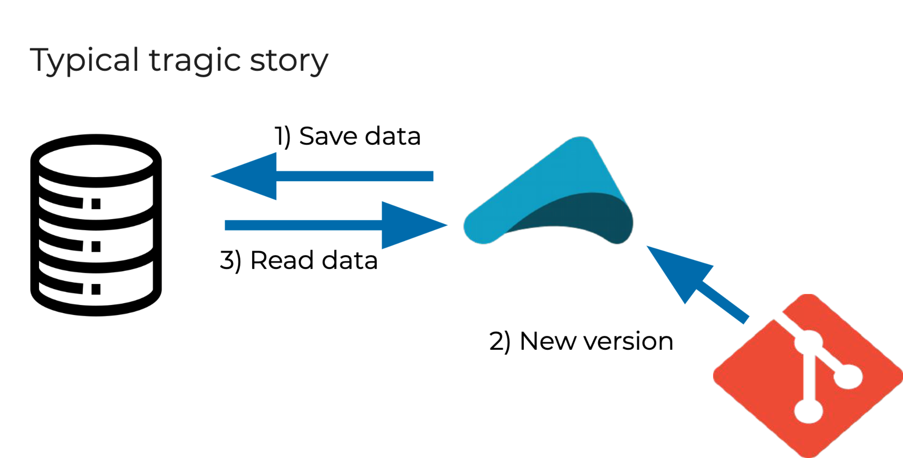
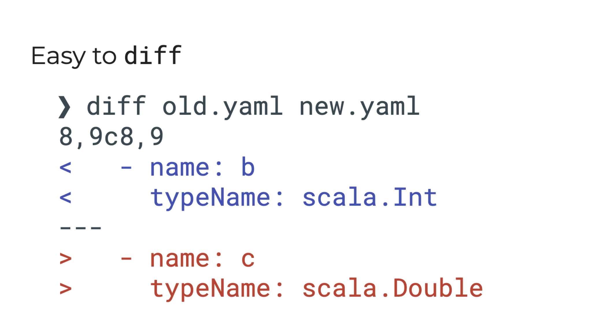

# Akka Serialization Helper

[](https://mvnrepository.com/artifact/org.virtuslab.ash)
[](https://github.com/VirtusLab/akka-serialization-helper/actions)
[](LICENSE)


Serialization toolbox for Akka messages, events and persistent state that helps achieve compile-time guarantee on
serializability. There are some Akka serialization caveats this tool can help with:
1. [Missing serialization binding](#missing-serialization-binding)
2. [Incompatibility of persistent data](#incompatibility-of-persistent-data)
3. [Jackson Akka Serializer](#jackson-akka-serializer)
4. [Missing Codec registration](#missing-codec-registration)

<!-- <PEKKO-REMOVE-START> --->
# ⚠️ Check [pekko-serialization-helper](https://github.com/VirtusLab/pekko-serialization-helper) for Pekko ⚠️
<!-- <PEKKO-REMOVE-END> --->

## Install

Add the following line to `plugins.sbt` (take `Version` from the above Maven badge or [GitHub Releases](https://github.com/VirtusLab/akka-serialization-helper/releases)):

```scala
addSbtPlugin("org.virtuslab.ash" % "sbt-akka-serialization-helper" % Version)
```

and enable the sbt plugin in the target project:
```scala
lazy val app = (project in file("app"))
  .enablePlugins(AkkaSerializationHelperPlugin)
```

## Missing serialization binding

To serialize message, persistent state or event in Akka, Scala trait needs to be defined:

```scala
package org
trait MySer
```

Also, a serializer needs to be bound to this trait in a configuration file:

```scala
akka.actor {
  serializers {
    jackson-json = "akka.serialization.jackson.JacksonJsonSerializer"
  }
  serialization-bindings {
    "org.MySer" = jackson-json
  }
}
```

The [problem](#appendix-b-what-happens-with-serialization-of-messages--events--states-that-do-not-extend-a-base-trait-bound-to-a-serializer) occurs if a class is not extended with the base trait bound to the serializer:

```scala
trait MySer
case class MyMessage() // extends MySer
```

`akka-serialization-helper` to the rescue! It detects messages, events and persistent states, and checks whether they
extend the given base trait and report an error when they don't. This ensures that the specified serializer is
used by Akka and protects against an unintended fallback to
[Java serialization](https://doc.akka.io/docs/akka/current/serialization.html#java-serialization) or outright
serialization failure.

To use, base trait should be annotated with [`@org.virtuslab.ash.SerializabilityTrait`](annotation/src/main/scala/org/virtuslab/ash/annotation/SerializabilityTrait.scala):

```scala
@SerializabilityTrait
trait MySerializable
```

It allows catching errors like these:
```scala
import akka.actor.typed.Behavior

object BehaviorTest {
  sealed trait Command //extends MySerializable
  def method(msg: Command): Behavior[Command] = ???
}
```

And results in a compile error, preventing non-runtime-safe code from being executed:
```
test0.scala:7: error: org.random.project.BehaviorTest.Command is used as Akka message
but does not extend a trait annotated with org.virtuslab.ash.annotation.SerializabilityTrait.
Passing an object of a class that does NOT extend a trait annotated with SerializabilityTrait as a message may cause Akka to
fall back to Java serialization during runtime.


  def method(msg: Command): Behavior[Command] = ???
                            ^
test0.scala:6: error: Make sure this type is itself annotated, or extends a type annotated
with  @org.virtuslab.ash.annotation.SerializabilityTrait.
  sealed trait Command extends MySerializable
               ^
```


The compiler plugin only checks the classes in the sbt modules where `AkkaSerializationHelperPlugin` is explicitly enabled.
It may happen that the base trait (like `MySerializable` in the example) lives in an sbt module like `core` where the plugin
should **not** be enabled (e.g. for compilation performance reasons).
However, `MySerializable` needs to be annotated with `org.virtuslab.ash.SerializabilityTrait`.
In order to have access to the `SerializabilityTrait` annotation without enabling the entire suite of compiler plugins,
add `AkkaSerializationHelperPlugin.annotation` to `libraryDependencies`:

```scala
import org.virtuslab.ash.AkkaSerializationHelperPlugin

lazy val core = (project in file("core"))
  .settings(libraryDependencies += AkkaSerializationHelperPlugin.annotation)
```

## Incompatibility of persistent data



A typical problem with a persistence is when the already persisted data is not compatible
with the schemas defined in a new version of the application.

To solve this, a mix of a compiler plugin and an sbt task can be used for dumping schema
of [akka-persistence](https://doc.akka.io/docs/akka/current/typed/persistence.html#example-and-core-api) to a
file. It can be used for detecting accidental changes of events (journal) and states (snapshots) with a simple `diff`.

To dump persistence schema for each sbt module where `AkkaSerializationHelperPlugin` is enabled, run:

```shell
sbt ashDumpPersistenceSchema
```

Default file is `target/<sbt-module-name>-dump-persistence-schema-<version>.yaml` (`target/` of top-level module!) but it can be changed using sbt keys:
```scala
ashDumpPersistenceSchemaOutputFilename := "file.yaml" // Changes filename
ashDumpPersistenceSchemaOutputDirectoryPath := "~" // Changes directory
```

#### Example dump
```yaml
- name: org.random.project.Data
  typeSymbol: trait
- name: org.random.project.Data.ClassTest
  typeSymbol: class
  fields:
  - name: a
    typeName: java.lang.String
  - name: b
    typeName: scala.Int
  - name: c
    typeName: scala.Double
  parents:
  - org.random.project.Data
- name: org.random.project.Data.ClassWithAdditionData
  typeSymbol: class
  fields:
  - name: ad
    typeName: org.random.project.Data.AdditionalData
  parents:
  - org.random.project.Data
```

A `diff` command can be used to check the difference between the version of a schema from `develop`/`main` branch and the
version from the current commit.




## Jackson Akka Serializer

Using Jackson Serializer for akka-persistence is also one of the pitfalls and this
plugin provides an alternative by using a serializer that uses [Circe](https://circe.github.io/circe/).

Dangerous code for Jackson:

```scala
case class Message(animal: Animal) extends MySer

sealed trait Animal

final case class Lion(name: String) extends Animal
final case class Tiger(name: String) extends Animal
```

To make this code work, a lot of Jackson annotations should be added:

```scala
case class Message(animal: Animal) extends MultiDocPrintService

@JsonTypeInfo(use = JsonTypeInfo.Id.NAME, property = "type")
@JsonSubTypes(
  Array(
    new JsonSubTypes.Type(value = classOf[Lion], name = "lion"),
    new JsonSubTypes.Type(value = classOf[Tiger], name = "tiger")))
sealed trait Animal

final case class Lion(name: String) extends Animal
final case class Tiger(name: String) extends Animal

```

Also if an object is defined:
```scala
case object Tick
```

There will not be exceptions during serialization but Jackson will create
another instance of `Tick` instead of restoring the `object Tick`'s underlying singleton.

```scala
actorRef ! Tick

// Inside the actor:
def receive = {
  case Tick => // this won't get matched
} // message will be unhandled
```

A [Circe-based](https://circe.github.io/circe/) Akka serializer can be used. It uses Circe codecs, derived using [Shapeless](https://circe.github.io/circe/codecs/auto-derivation.html),
that are generated during compile time (so serializer won't crash during runtime as reflection-based serializers may do).
For a comparison of Circe with other serializers, read [Appendix A](#appendix-a-comparison-of-available-akka-serializers).

Note that it is **not** obligatory to use this serializer for the other features (serializability checker, persistence schema dump) to work.
They work as well with e.g. when [Jackson serializer](https://doc.akka.io/docs/akka/current/serialization-jackson.html) is selected.

#### Usage

Add the following to project dependencies:

```scala
import org.virtuslab.ash.AkkaSerializationHelperPlugin

lazy val app = (project in file("app"))
  // ...
  .settings(libraryDependencies += AkkaSerializationHelperPlugin.circeAkkaSerializer)
```

Note that enabling `AkkaSerializationHelperPlugin` does **not** add Circe serializer to the classpath automatically,
as this sbt plugin can be used to improve safety of other serializers as well.

Create a custom serializer by extending `CirceAkkaSerializer` base class:
```scala
import org.virtuslab.ash.circe.CirceAkkaSerializer

class ExampleSerializer(actorSystem: ExtendedActorSystem)
    extends CirceAkkaSerializer[MySerializable](actorSystem) {

  override def identifier: Int = 41

  override lazy val codecs = Seq(Register[CommandOne], Register[CommandTwo])

  override lazy val manifestMigrations = Nil

  override lazy val packagePrefix = "org.project"
}
```
`CirceAkkaSerializer` can be configured to use Gzip compression when serializing payloads greater than defined size (default is without compression).

See [default reference.conf file](circe-akka-serializer/src/main/resources/reference.conf) with comments for more details about `CirceAkkaSerializer` configuration.

For more guidelines on how to use the serializer,
read [Akka documentation about serialization](https://doc.akka.io/docs/akka/current/serialization.html),
[`CirceAkkaSerializer`](circe-akka-serializer/src/main/scala/org/virtuslab/ash/circe/CirceAkkaSerializer.scala) Scaladoc
and look at the [examples](examples).

## Missing Codec registration

If a codec is not registered, a runtime exception will occur.
```scala
import org.virtuslab.ash.circe.CirceAkkaSerializer
import org.virtuslab.ash.circe.Register

class ExampleSerializer(actorSystem: ExtendedActorSystem)
  extends CirceAkkaSerializer[MySerializable](actorSystem) {
  // ...
  override lazy val codecs = Seq(Register[CommandOne]) // WHOOPS someone forgot to register CommandTwo...
}
```
```shell
java.lang.RuntimeException: Serialization of [CommandTwo] failed. Call Register[A]
for this class or its supertype and append result to `def codecs`.
```

To solve that, an annotation
[`@org.virtuslab.ash.Serializer`](annotation/src/main/scala/org/virtuslab/ash/annotation/Serializer.scala)
can be used.

During compilation, the plugin gathers all direct descendants of the class marked with [`@org.virtuslab.ash.SerializabilityTrait`](annotation/src/main/scala/org/virtuslab/ash/annotation/SerializabilityTrait.scala)
and checks the body of classes annotated with [`@org.virtuslab.ash.Serializer`](annotation/src/main/scala/org/virtuslab/ash/annotation/Serializer.scala) if they reference all these direct descendants in any way.

In practice, this is used for checking a class extending [CirceAkkaSerializer](circe-akka-serializer/src/main/scala/org/virtuslab/ash/circe/CirceAkkaSerializer.scala), like this:

```scala
import org.virtuslab.ash.circe.CirceAkkaSerializer
import org.virtuslab.ash.circe.Register

@Serializer(
  classOf[MySerializable],
  typeRegexPattern = Register.REGISTRATION_REGEX)
class ExampleSerializer(actorSystem: ExtendedActorSystem)
  extends CirceAkkaSerializer[MySerializable](actorSystem) {
    // ...
    override lazy val codecs = Seq(Register[CommandOne]) // WHOOPS someone forgot to register CommandTwo...
    // ... but Codec Registration Checker will throw a compilation error here:
    // `No codec for `CommandOne` is registered in a class annotated with @org.virtuslab.ash.annotation.Serializer`
}
```

Note that as with Serializability Checker and Dump Persistence Schema,
this compiler plugin only runs in the sbt modules where `AkkaSerializationHelperPlugin` is explicitly enabled.

For more information, read [`@Serializer` scaladoc](annotation/src/main/scala/org/virtuslab/ash/annotation/Serializer.scala).

## Additional configuration for compiler plugins

All compiler plugins and their verbose modes can be enabled/disabled using two sbt keys:

```scala
ashCompilerPluginEnable := false // default is true
ashCompilerPluginVerbose := true // default is false
```

This can be done for all compiler plugins, like above, or just one:
```scala
ashCodecRegistrationCheckerCompilerPlugin / ashCompilerPluginEnable := false
ashDumpPersistenceSchemaCompilerPlugin / ashCompilerPluginVerbose := true
```

Additionally, `Compile` and `Test` scope can be specified:

```scala
Compile / ashDumpPersistenceSchemaCompilerPlugin / ashCompilerPluginVerbose := true
Test / ashCompilerPluginEnable := false
```

For full list of sbt keys, check [`org.virtuslab.ash.AkkaSerializationHelperKeys`](sbt-akka-serialization-helper/src/main/scala/org/virtuslab/ash/AkkaSerializationHelperKeys.scala).

## Example applications
The simplest example is the akka-cluster application which uses Akka Serialization Helper: [akka-cluster-app](examples/akka-cluster-app).

The second example is the akka-persistence application which shows usage of the Dump Persistence Schema Compiler Plugin: [akka-persistence-app](examples/akka-persistence-app).

## Step-by-step guide
See [full step-by-step guide](docs/GUIDE.md) on Akka Serialization Helper usage.

## Contributing Guide

If you want to contribute to this project, see [Contributing Guide](CONTRIBUTING.md).

## Appendix A: Comparison of available Akka Serializers

| Serializer             | [Jackson](https://github.com/FasterXML/jackson)                                                                                                                                                                                                                                                                                                                                                                                                    | [Circe](https://circe.github.io/circe/)                                                                                                                                                                                                                    | [Protobuf v3](https://developers.google.com/protocol-buffers)                                                                                                                                                                                       | [Avro](https://avro.apache.org/docs/current/)                                                                                                                                        | [Borer](https://github.com/sirthias/borer)                                                                                        | [Kryo](https://github.com/EsotericSoftware/kryo)                                                          |
|:-----------------------|:---------------------------------------------------------------------------------------------------------------------------------------------------------------------------------------------------------------------------------------------------------------------------------------------------------------------------------------------------------------------------------------------------------------------------------------------------|:-----------------------------------------------------------------------------------------------------------------------------------------------------------------------------------------------------------------------------------------------------------|:----------------------------------------------------------------------------------------------------------------------------------------------------------------------------------------------------------------------------------------------------|:-------------------------------------------------------------------------------------------------------------------------------------------------------------------------------------|:----------------------------------------------------------------------------------------------------------------------------------|:----------------------------------------------------------------------------------------------------------|
| Data formats           | JSON or [CBOR](https://cbor.io)                                                                                                                                                                                                                                                                                                                                                                                                                    | JSON                                                                                                                                                                                                                                                       | JSON or custom binary                                                                                                                                                                                                                               | JSON or custom binary                                                                                                                                                                | JSON or CBOR                                                                                                                      | custom binary                                                                                             |
| Scala support          | very poor, even with [jackson-module-scala](https://github.com/FasterXML/jackson-module-scala): <ul><li>poor support for Scala objects, without configuration (without adding ScalaObjectDeserializerModule usage) creates new instances of singleton types (`Foo$`), breaking pattern matching</li><li>lacks support of basic scala types like `Unit`</li><li>without explicit annotation doesn't work with generics extending `AnyVal`</li></ul> | perfect out of the box                                                                                                                                                                                                                                     | perfect with [ScalaPB](https://scalapb.github.io)                                                                                                                                                                                                   | perfect with [Avro4s](https://github.com/sksamuel/avro4s)                                                                                                                            | perfect out of the box                                                                                                            | perfect out of the box                                                                                    |
| Akka support           | [akka-serialization-jackson](https://doc.akka.io/docs/akka/current/serialization-jackson.html)                                                                                                                                                                                                                                                                                                                                                     | [serializer provided by this project](#jackson-akka-serializer)                                                                                                                                                                                            | used by [akka-remote](https://doc.akka.io/docs/akka/current/serialization.html) internally                                                                                                                                                          | requires custom serializer                                                                                                                                                           | requires custom serializer                                                                                                        | [akka-kryo](https://github.com/altoo-ag/akka-kryo-serialization)                                          |
| Compile-time mechanics | nothing happens in compile time; everything based on runtime reflection                                                                                                                                                                                                                                                                                                                                                                            | derives codecs via [Shapeless](https://circe.github.io/circe/codecs/auto-derivation.html)                                                                                                                                                                  | with ScalaPB, generates Scala classes based on \*.proto files                                                                                                                                                                                       | with Avro4s, derives Avro schemas using [Magnolia](https://github.com/softwaremill/magnolia)                                                                                         | derives codecs **without** Magnolia                                                                                               | with akka-kryo, optionally derives codecs in compile time, but otherwise uses reflection in runtime       |
| Runtime safety         | none, uses reflection                                                                                                                                                                                                                                                                                                                                                                                                                              | encoders and decoders are created during compilation                                                                                                                                                                                                       | \*.proto files are validated before compilation                                                                                                                                                                                                     | Avro schema is created during compilation                                                                                                                                            | encoders and decoders are created during compilation                                                                              | depends on whether codecs were derived in compile time (then standard for Scala code), or not (than none) |
| Boilerplate            | a lot: <ul><li>ADTs requires amount of annotation equal to or exceeding the actual type definitions</li><li>requires explicit serializers and deserializers in certain cases (e.g. enums)</li></ul>                                                                                                                                                                                                                                                | every top-level sealed trait must be registered manually - but see [Codec Registration Checker](#missing-codec-registration)                                                                                                                               | in case of custom types, a second layer of models is needed                                                                                                                                                                                         | sometimes requires annotations                                                                                                                                                       | every top-level sealed trait must be registered manually; every transitively included class must have an explicitly defined codec | every top-level sealed trait must be registered manually                                                  |
| Schema evolution       | <ul><li>removing field</li><li>adding optional field</li></ul> with [`JacksonMigration`](https://doc.akka.io/docs/akka/current/serialization-jackson.html#schema-evolution): <ul><li>adding mandatory field</li><li>renaming field</li><li>renaming class</li><li>support of forward versioning for rolling updates</li></ul>                                                                                                                      | <ul><li>adding optional field</li><li>removing optional field</li><li>adding required field with default value</li><li>removing required field</li><li>renaming field</li><li>reordering fields</li><li>transforming data before deserialization</li></ul> | <ul><li>adding optional field</li><li>removing optional field</li><li>adding required field with default value</li><li>removing required field</li><li>renaming field</li><li>reordering fields</li><li>changing between compatible types</li></ul> | <ul><li>reordering fields</li><li>renaming fields</li><li>adding optional field</li><li>adding required field with default value</li><li>removing field with default value</li></ul> | <ul><li>renaming fields</li><li>transforming data before deserialization</li></ul>                                                | <ul><li>adding field</li><li>removing field</li><li>renaming field</li><li>renaming class</li></ul>       |

## Appendix B: what happens with serialization of Messages / Events / States that do not extend a base trait bound to a serializer

In runtime, if given Message/Event/State class does not extend a base trait bound to a serializer, the following problems will occur (depending on Akka version and settings):

**Note** - the default setting for Akka 2.5 is `akka.actor.allow-java-serialization=on`, whereas `akka.actor.allow-java-serialization=off` is the default setting for Akka 2.6

| Akka version                                | `akka.actor.allow-java-serialization=off`                                                                                                                                                                                                                                                                                                                                                                                                                                                                                                                                                                                                                                                                                                                                                                                                                                                                                                                                                                                                                                                                                                                                                                                                                                                                                                                                                                                                                                                                                                                                                                                                                                                                                                                                                                                                                                                                                                                                                                                                                                                                                                                                                                                                                                                                                                                                                                                                         | `akka.actor.allow-java-serialization=on`                                                                                                                                                                                                                                                                                                                                                                                                                    |
|---------------------------------------------|----------------------------------------------------------------------------------------------------------------------------------------------------------------------------------------------------------------------------------------------------------------------------------------------------------------------------------------------------------------------------------------------------------------------------------------------------------------------------------------------------------------------------------------------------------------------------------------------------------------------------------------------------------------------------------------------------------------------------------------------------------------------------------------------------------------------------------------------------------------------------------------------------------------------------------------------------------------------------------------------------------------------------------------------------------------------------------------------------------------------------------------------------------------------------------------------------------------------------------------------------------------------------------------------------------------------------------------------------------------------------------------------------------------------------------------------------------------------------------------------------------------------------------------------------------------------------------------------------------------------------------------------------------------------------------------------------------------------------------------------------------------------------------------------------------------------------------------------------------------------------------------------------------------------------------------------------------------------------------------------------------------------------------------------------------------------------------------------------------------------------------------------------------------------------------------------------------------------------------------------------------------------------------------------------------------------------------------------------------------------------------------------------------|-------------------------------------------------------------------------------------------------------------------------------------------------------------------------------------------------------------------------------------------------------------------------------------------------------------------------------------------------------------------------------------------------------------------------------------------------------------|
| 2.5 | Serialization will fail with logs like below:<br><br>```[WARN] [...] Outgoing message attempted to use Java Serialization even though `akka.actor.allow-java-serialization = off` was set! Message type was: [class sample.cluster.transformation.BackendRegistration$]```<br><br> ```[ERROR] [...] Failed to serialize remote message [class akka.actor.ActorSelectionMessage] using serializer [class akka.remote.serialization.MessageContainerSerializer]. Transient association error (association remains live)```<br><br>```akka.remote.MessageSerializer$SerializationException: Failed to serialize remote message```<br> ```[class akka.actor.ActorSelectionMessage] using serializer [class akka.remote.serialization.MessageContainerSerializer].```<br> ```at akka.remote.MessageSerializer$.serialize(MessageSerializer.scala:67)```<br> ```at akka.remote.EndpointWriter.$anonfun$serializeMessage$1(Endpoint.scala:1021)```<br> ```at scala.util.DynamicVariable.withValue(DynamicVariable.scala:62)```<br> ```at akka.remote.EndpointWriter.serializeMessage(Endpoint.scala:1021)```<br> ```at akka.remote.EndpointWriter.writeSend(Endpoint.scala:887)```<br> ```at akka.remote.EndpointWriter$$anonfun$4.applyOrElse(Endpoint.scala:859)```<br> ```at akka.actor.Actor.aroundReceive(Actor.scala:539)```<br> ```at akka.actor.Actor.aroundReceive$(Actor.scala:537)```<br> ```at akka.remote.EndpointActor.aroundReceive(Endpoint.scala:536)```<br> ```at akka.actor.ActorCell.receiveMessage(ActorCell.scala:612)```<br> ```at akka.actor.ActorCell.invoke(ActorCell.scala:581)```<br> ```at akka.dispatch.Mailbox.processMailbox(Mailbox.scala:268)```<br> ```at akka.dispatch.Mailbox.run(Mailbox.scala:229)```<br> ```at akka.dispatch.Mailbox.exec(Mailbox.scala:241)```<br> ```at akka.dispatch.forkjoin.ForkJoinTask.doExec(ForkJoinTask.java:260)```<br> ```at akka.dispatch.forkjoin.ForkJoinPool$WorkQueue.runTask(ForkJoinPool.java:1339)```<br> ```at akka.dispatch.forkjoin.ForkJoinPool.runWorker(ForkJoinPool.java:1979)```<br> ```at akka.dispatch.forkjoin.ForkJoinWorkerThread.run(ForkJoinWorkerThread.java:107)```<br> ```Caused by: akka.serialization.DisabledJavaSerializer$JavaSerializationException: Attempted to serialize message using Java serialization while `akka.actor.allow-java-serialization` was disabled. Check WARNING logs for more details.``` | Serialization succeeds - but using Java serialization (which is not a good choice for production). Warning log like below will appear on the startup:<br><br> ```[WARN] [...] Using the default Java serializer for class [sample.cluster.transformation.TransformationResult] which is not recommended because of performance implications. Use another serializer or disable this warning using the setting 'akka.actor.warn-about-java-serializer-usage'```                                                                                                                                                                                                                                                                                                                                                                                                                                                            |
| 2.6 | Serialization will fail with logs like below:<br><br> ```[WARN] [...] - Outgoing message attempted to use Java Serialization even though`akka.actor.allow-java-serialization = off` was set! Message type was: [class sample.cluster.transformation.Worker$TransformText]```<br><br> ```[ERROR] [...] - Failed to serialize message [sample.cluster.transformation.Worker$TransformText]. akka.serialization.DisabledJavaSerializer$JavaSerializationException: Attempted to serialize message using Java serialization while `akka.actor.allow-java-serialization` was disabled. Check WARNING logs for more details```                                                                                                                                                                                                                                                                                                                                                                                                                                                                                                                                                                                                                                                                                                                                                                                                                                                                                                                                                                                                                                                                                                                                                                                                                                                                                                                                                                                                                                                                                                                                                                                                                                                                                                                                                                                                                                                                                                                                               | Serialization succeeds - but using Java serialization (which is not a good choice for production). Warning log like below will appear on the startup:<br><br> ```[WARN] [...] Using the default Java serializer for class [sample.cluster.transformation.TransformationResult] which is not recommended because of performance implications. Use another serializer or disable this warning using the setting 'akka.actor.warn-about-java-serializer-usage'``` |
